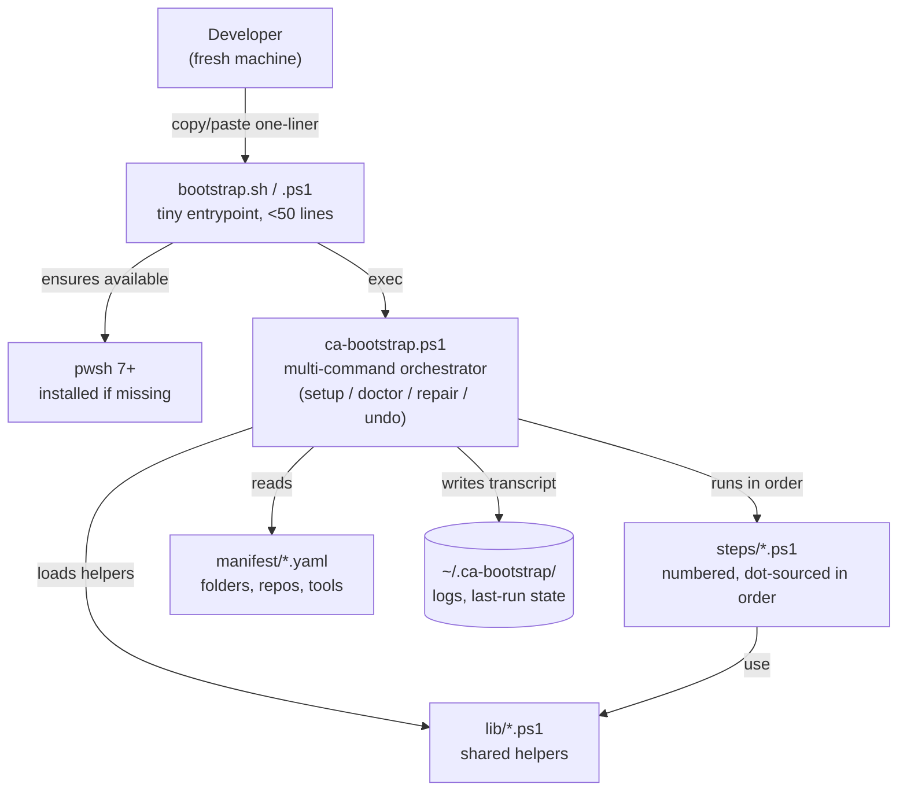

# ca-bootstrap — Design specification

| Field | Value |
|---|---|
| Document | Design specification (v1.0 draft) |
| Status | Approved scope, not yet implemented |
| Author | Peter Giannopoulos |
| Created | 2026-05-03 |
| Target audience | Engineers implementing or reviewing ca-bootstrap |

---

## Table of contents

1. [Overview](#1-overview)
2. [Goals and non-goals](#2-goals-and-non-goals)
3. [Architecture](#3-architecture)
4. [Commands](#4-commands)
5. [User experience walkthroughs](#5-user-experience-walkthroughs)
6. [Manifest schemas](#6-manifest-schemas)
7. [Step-by-step specification](#7-step-by-step-specification)
8. [Action journal](#8-action-journal)
9. [Cross-platform install matrix](#9-cross-platform-install-matrix)
10. [Authentication and identity](#10-authentication-and-identity)
11. [Idempotency contract](#11-idempotency-contract)
12. [Non-interactive mode](#12-non-interactive-mode)
13. [Logging and privacy](#13-logging-and-privacy)
14. [Error handling](#14-error-handling)
15. [Testing strategy](#15-testing-strategy)
16. [Distribution and versioning](#16-distribution-and-versioning)
17. [Build sequence](#17-build-sequence)
18. [Security considerations](#18-security-considerations)
19. [Future work](#19-future-work)

---

## 1. Overview

`ca-bootstrap` is a developer-facing onboarding tool. A new ChannelAssist engineer runs one command and the tool sets up their machine: installs prerequisites, authenticates against GitHub, creates the standard folder structure under `ChannelAssistDev/`, clones the repos they have access to, and configures per-folder git identity.

The tool is a **multi-command CLI** with four top-level operations:

| Command | When to use it |
|---|---|
| `setup` | First-time onboarding (also the default — the bootstrap one-liner runs this) |
| `doctor` | "Is my setup correct?" — diagnostic-only, no changes, exits non-zero on drift |
| `repair` | Fix what doctor found — targeted (`--target dotnet-10`) or wholesale (`--all`) |
| `undo` | Reverse what ca-bootstrap did — for offboarding or laptop refresh |

Today, onboarding is a multi-page README that mixes Windows, macOS, and Linux instructions, has no idempotency, no diagnostic surface, no clean offboarding path, and gives a new hire no signal whether they're done. `ca-bootstrap` replaces it with a single guided session, a verifier, a fixer, and a reverser.

The tool runs on **PowerShell 7+** (cross-platform). Windows hosts already have it (or one `winget` away); on macOS/Linux a thin shell bootstrapper installs it before handing off.

## 2. Goals and non-goals

### Goals

- **One-line bootstrap** — copy-paste from the README, no prior setup needed.
- **Cross-platform parity** — Windows is the primary target; macOS and Linux are first-class.
- **Every step optional and confirmable** — defaults are sensible, but the user is always in control.
- **Idempotent** — re-running is safe; detects and skips already-done work.
- **Source-of-truth manifests** — folder structure, repo list, and tool list live in YAML so they can be updated without touching code.
- **Auditable** — public repo, < 50-line bootstrap scripts, transcript log of every action.
- **Unattended mode** — same script supports IT pre-provisioning via a YAML answers file.

### Non-goals (v1)

- **Auto-update.** v1 is pinned to whatever you cloned; later versions can self-update.
- **Health monitoring.** Beyond the verify-only flag, no continuous reporting.
- **Team-specific manifests.** One manifest covers everyone in v1; team-specific subsets are future work.
- **Credential helpers beyond gh.** Azure DevOps PAT prompts (for `ado-legacy/`) are out of scope.
- **GUI.** Interactive CLI only.
- **Dependency management for active repos.** We install language runtimes; per-repo `npm install` / `dotnet restore` / `pip install` stays the responsibility of each repo's own README.

## 3. Architecture



**Key boundaries**

- **Bootstrap layer** is dumb on purpose: ensure `pwsh` exists, clone the repo, hand off. < 50 lines per file. Auditable.
- **Orchestrator** (`ca-bootstrap.ps1`) parses the command name and flags, dispatches to one of the four command modules in `commands/`, and handles top-level error trapping.
- **Command modules** (`commands/setup.ps1`, `doctor.ps1`, `repair.ps1`, `undo.ps1`) compose the step library and the journal differently; each has its own walkthrough above.
- **Steps** are independent units. Each step:
  - Checks if its work is already done (idempotency).
  - Asks the user if it should proceed.
  - Performs its work, logging to the transcript.
  - Returns a structured result (`@{ status = 'ok' | 'skipped' | 'failed'; details = ... }`).
- **Lib** has no side effects — pure helpers (UI primitives, OS dispatch, YAML parsing, git ops).
- **Manifests** are data. Editing them does not require touching PowerShell code.
- **State directory** at `~/.ca-bootstrap/` holds transcripts and prior-run summaries for verify-only mode.

## 4. Commands

The orchestrator script is `ca-bootstrap.ps1`. It dispatches to one of four command modules in `commands/` based on the first positional argument.

### 4.1 `setup`

Default command — runs the full interactive onboarding wizard. Steps 10–80 execute in order. Each step:

1. Detects current state.
2. If state is already correct → reports "skip".
3. Otherwise prompts the user, performs the action, and records it to the [action journal](#8-action-journal).

**Flags**: `-Unattended -ConfigFile <path>`, `-WhatIf`, `-Verbose`.

**Exit codes**: see [error handling](#14-error-handling).

### 4.2 `doctor`

Diagnostic-only. Runs the **detection** phase of every step but never changes anything. Output is a green/yellow/red table:

```
ca-bootstrap doctor — 2026-05-15 09:32

Workspace                ✓  ~/Documents/.../ChannelAssistDev exists
Folder structure         ✓  4/4 folders present
Prerequisites
  git                    ✓  2.43.0
  gh                     ✓  2.42.0
  dotnet-10              ✗  not installed         → repair --target dotnet-10
  node-20                ⚠  18.18.0 (older)        → repair --target node-20
  python-312             ✓  3.12.1
  docker                 ✓  24.0.6
  vscode                 ✓  1.85.0
GitHub auth              ✓  logged in as user-g
Repositories             ⚠  13/14 cloned          → repair --target repos
  cm-product/cm-shared-libs  missing
Git identity             ✓  configured for ChannelAssistDev/
Action journal           ✓  ~/.ca-bootstrap/journal.yaml is consistent

3 issues found. Run `ca-bootstrap.ps1 repair --all` to fix them.
```

**Behavior**:

- Read-only. Never installs, clones, or modifies config.
- Reads the [action journal](#8-action-journal) so it knows what *should* be present.
- Compares journal to disk to detect drift (e.g., a repo was deleted manually).
- Exits 0 if everything is ✓, non-zero if anything is ⚠ or ✗.
- Designed to run in CI: drop it on a hosted runner to verify a developer image hasn't drifted.
- Output formats: human (default), `--json` for scripting, `--summary` for short version.

**Flags**: `--json`, `--summary`, `--target <id>` (check only one item), `--quiet`.

### 4.3 `repair`

Fixes problems doctor found. Two modes:

```powershell
./ca-bootstrap.ps1 repair --all
./ca-bootstrap.ps1 repair --target dotnet-10
./ca-bootstrap.ps1 repair --target repos
./ca-bootstrap.ps1 repair --target identity
```

**Behavior**:

- Runs doctor first (silently).
- For each ✗ or ⚠ finding (or just the targeted one):
  - Shows the finding.
  - Asks for confirmation: `[Y]es / [n]o / [a]ll-yes / [q]uit`.
  - Runs the same code path the corresponding `setup` step would have run, in install/fix mode.
  - Records the action in the journal (or amends an existing entry).
- After fixing, re-runs doctor to confirm green.
- Exits 0 if everything is now ✓, 1 if user quit, non-zero if any fix failed.

**Targets**:

| Target | What it repairs |
|---|---|
| `--all` | Every ✗ and ⚠ doctor reports |
| `--target <tool-id>` | Install or upgrade a specific tool from `tools.yaml` |
| `--target repos` | Re-clone or fetch missing/broken repos |
| `--target repos:<slug>` | Just one repo |
| `--target identity` | Re-write the per-folder git identity config |
| `--target gh-auth` | Re-run `gh auth login` |
| `--target folders` | Recreate any missing top-level folders |
| `--target journal` | Rebuild the journal from on-disk state (recovery if the journal is lost) |

**Flags**: `--all`, `--target <id>`, `-Unattended`, `-WhatIf`, `--auto-confirm` (skip per-fix prompts).

### 4.4 `undo`

Reverses changes ca-bootstrap made. Reads the [action journal](#8-action-journal) and walks entries in reverse order. Each entry has a `can_undo` flag; entries that can't be reversed (or shouldn't, like a system-wide tool install that other projects might depend on) are listed but not acted on without explicit confirmation.

```
ca-bootstrap undo

This will reverse 14 actions recorded in the journal:

  Reversible without warning (4):
    ✓ Per-folder git identity (~/.gitconfig includeIf entry + workspace .gitconfig)
    ✓ VS Code workspace file (ChannelAssist.code-workspace)
    ✓ Empty workspace folder (~/Documents/.../ChannelAssistDev)
    ✓ Action journal itself (~/.ca-bootstrap/)

  Reversible but destructive — confirm each (3):
    ⚠ Cloned repo: docs/keystone (15 MB)
    ⚠ Cloned repo: ca-platform/ca-privacy-gate (8 MB)
    ⚠ Cloned repo: ca-platform/ca-data-dictionnary-generator (12 MB) — has uncommitted changes!
    ⚠ ... 11 more (49 MB total)

  Tool installs not auto-reversed (other projects may depend on them):
    ⓘ git, gh, dotnet-10, node-20, python-312, docker, vscode

Proceed?
  [Y]es (interactive — confirm each)
  [a]ll (reverse all reversible without warning + cloned repos)
  [s]elect (pick which categories to undo)
  [n]o / quit
```

**Behavior**:

- Always interactive by default. Unattended mode requires `--force` plus the answer file.
- For each reversible action:
  - Show what will be undone.
  - For destructive entries (cloned repos, especially ones with uncommitted work): require explicit confirmation per item.
  - Perform the reversal.
  - Mark the journal entry as undone.
- Tool uninstalls require `--include-tools` because uninstalling git or Node could break unrelated projects.
- After undo, the journal is preserved (entries marked undone) so the operation itself is auditable.

**Targets**:

| Target | Effect |
|---|---|
| (default) | Reverse every reversible action interactively |
| `--target identity` | Just remove the gitconfig includeIf entry |
| `--target repos` | Just remove cloned repos (with per-repo confirm) |
| `--target repos:<slug>` | Just one repo |
| `--target workspace` | Remove the workspace folder if empty |
| `--target journal` | Reset the journal (no on-disk reversal) |
| `--include-tools` | Also uninstall tools (heavy confirmation per tool) |
| `--include-folders` | Also remove the empty folder structure |

**Flags**: `--target <id>`, `--include-tools`, `--include-folders`, `--force`, `-Unattended`, `-WhatIf`.

**Safety rules** (always enforced):

- Never delete a directory that has uncommitted git changes without `--force`.
- Never delete a directory that contains files unknown to ca-bootstrap's journal without `--force`.
- Never remove a workspace folder unless it's empty (or `--force` is set).
- Never uninstall a tool without `--include-tools` plus per-tool confirmation.

## 5. User experience walkthroughs

This section shows annotated transcripts for each command. macOS and Linux output is identical except install commands.

### 5.1 `setup` walkthrough

The first-time onboarding flow. Demonstrates a developer running ca-bootstrap on a fresh Windows machine end-to-end.

```
ChannelAssist developer onboarding (ca-bootstrap v1.0.0)
========================================================

Detected: Windows 11 22H2, PowerShell 7.4.0, x64

Step 1/8 — Welcome
  This wizard will set up your machine for ChannelAssist development:
    • install missing tools (git, gh, .NET 10, Node 20, Python 3.12,
      Docker Desktop, VS Code, VS Code extensions, optionally WSL2)
    • authenticate to GitHub
    • create the workspace folder structure
    • clone the repos you have access to
    • configure your git identity for ChannelAssist commits

  Every step is optional. Quit any time with Ctrl+C or 'q' at any prompt.
  A transcript will be saved to %USERPROFILE%\.ca-bootstrap\last-run.log.

  Continue? [Y/n]:

Step 2/8 — Prerequisites
  Detecting installed tools...
    ✓ git              2.43.0
    ✓ gh               2.42.0
    ✗ .NET SDK 10      not installed
    ✗ Node.js 20       not installed (Node 18 detected — older)
    ✓ Python 3.12      3.12.1
    ✗ Docker Desktop   not installed
    ✓ VS Code          1.85.0

  Install missing tools?
    [Y]es (install all)  [s]elect (choose individually)  [n]o (skip)  [q]uit

  > select

    .NET SDK 10 (≈250 MB, via winget)? [Y/n]: Y
      Installing Microsoft.DotNet.SDK.10...
      ✓ Installed in 47s.

    Node.js 20 LTS (≈30 MB, via winget; will set as default)? [Y/n]: Y
      Installing OpenJS.NodeJS.LTS...
      ✓ Installed in 22s.

    Docker Desktop (≈600 MB, requires reboot, license acceptance)? [y/N]: y
      Installing Docker.DockerDesktop...
      ✓ Installed. A reboot will be needed before Docker can run.

  VS Code extensions
    Install the recommended extensions?
      • GitHub.copilot (AI assistance)
      • ms-dotnettools.csharp (C# language)
      • ms-azuretools.vscode-docker (Docker)
      • ms-python.python (Python)
      • dbaeumer.vscode-eslint (ESLint)
      • eamodio.gitlens (Git supercharged)
    [Y]es (all)  [s]elect  [n]o
    > Y

Step 3/8 — GitHub authentication
  Checking gh auth status...
    Not logged in.

  Run `gh auth login` now? [Y/n]: Y
    Choose a protocol: HTTPS (recommended)
    Authenticate via browser? [Y/n]: Y
    Opening browser for device flow...
    ✓ Logged in as user-g.

Step 4/8 — Workspace location
  Default location: C:\Users\user\Documents\Projects\ChannelAssistDev

  Use this default?
    [Y]es  [c]ustom path  [n]o (skip remaining steps)
  > Y

Step 5/8 — Folder structure
  Will create at C:\Users\user\Documents\Projects\ChannelAssistDev:
    ├── docs\
    ├── ca-platform\
    ├── cm-product\
    └── ado-legacy\

  Continue? [Y/n]: Y
  ✓ Created.

Step 6/8 — Clone repositories
  Discovering your access via gh...
    You are a member of: @ChannelAssist (engineering team).
    You have access to all groups below.

  Clone the following groups?
    docs/                  3 repos    [Y/n/select]
      • ChannelAssist/Keystone               (master)
      • ChannelAssist/.github                (main)
      • ChannelAssist/.github-private        (main, members-only)
    ca-platform/           5 repos    [Y/n/select]
      • ChannelAssist/ca-ai-agents           (master)
      • ChannelAssist/ca-claude-plugin       (main)
      • ChannelAssist/ca-copilot-plugin      (main)
      • ChannelAssist/ca-data-dictionnary-generator (master)
      • ChannelAssist/ca-privacy-gate        (main)
    cm-product/            10 repos   [Y/n/select]
      • ChannelAssist/channel-manager        (dev)  [LARGE — ≈4 GB, 10+ min]
      • ChannelAssist/cm-claims-validator    (dev)
      • ... 8 more
    ado-legacy/            (skipped — TFVC, Azure DevOps clone not handled in v1)

  > select

    docs/ — clone all 3? [Y/n]: Y
    ca-platform/ — clone all 5? [Y/n]: Y
    cm-product/ — clone all 10? [Y/n/individual]: individual
      ChannelAssist/channel-manager (≈4 GB)? [y/N]: N        ← skip the legacy monolith
      ChannelAssist/cm-claims-validator? [Y/n]: Y
      ... etc.

  Cloning 14 repos in parallel (max 4 at a time)...
    [▓▓▓▓▓▓▓▓▓░] 12/14  cloning ChannelAssist/cm-shared-libs...
  ✓ All clones complete (3m 18s total).

Step 7/8 — Git identity for ChannelAssist
  Detected global git identity: Jane Doe <user.personal@example.com>

  ChannelAssist repos should commit with your work email. Configure
  per-workspace identity (uses git's includeIf — does not change global)?
  [Y/n]: Y

  Name for ChannelAssist commits [Jane Doe]:
  Email for ChannelAssist commits: user@channelassist.com

  ✓ Wrote ChannelAssistDev\.gitconfig
  ✓ Added includeIf entry to %USERPROFILE%\.gitconfig

Step 8/8 — Optional extras
  • Create VS Code multi-root workspace file at ChannelAssist.code-workspace? [Y/n]: Y
    ✓ Wrote ChannelAssistDev\ChannelAssist.code-workspace (14 folders)
  • Write workspace-root .vscode/ defaults (extensions/settings/launch/tasks)? [Y/n]: Y
    ✓ .vscode/ defaults: 4 written, 0 already present
  • Link ca-claude-plugin into ~/.claude/plugins so Claude Code can load it? [y/N]: Y
    ✓ Linked: %USERPROFILE%\.claude\plugins\ca-claude-plugin →
      ChannelAssistDev\ca-platform\ca-claude-plugin
      ⓘ Restart Claude Code or run its plugin-reload command to pick it up.
  • Show ca-copilot-plugin usage notes (how custom agents/prompts activate in your repos)? [y/N]: Y
    ⓘ ca-copilot-plugin cloned at:
        ChannelAssistDev\ca-platform\ca-copilot-plugin
      Custom agents and prompt files in this repo become available in Copilot
      Chat when synced into a consumer repo's .github/agents/ and
      .github/prompts/ via cm-platform-infra `make agents-sync`.
  • Install WSL2 + Ubuntu 22.04 (requires reboot)? [y/N]: N

  (Claude Code, the GitHub Copilot CLI, and the gh-copilot extension were already
  installed by step 2 from manifest/tools.yaml.)

Done in 14m 22s.

Next steps:
  1. Reboot to finish Docker Desktop installation.
  2. Open VS Code: code ChannelAssistDev\ChannelAssist.code-workspace
  3. Read the org profile: https://github.com/ChannelAssist
  4. Review the SDLC policy: ChannelAssistDev\docs\keystone\content\governance\policies\sdlc-policy-26.md

Transcript saved: %USERPROFILE%\.ca-bootstrap\last-run.log
Run again any time to verify your setup or top up missing pieces.
```

### 5.2 `doctor` walkthrough

```
$ ca-bootstrap.ps1 doctor

ChannelAssist developer setup — diagnostic report
=================================================
Generated: 2026-05-15 09:32 UTC
Host:      DESKTOP-USER (Windows 11 22H2, x64)
Workspace: C:\Users\user\Documents\Projects\ChannelAssistDev

Workspace                    ✓  exists, 4 expected folders present
Folder structure             ✓  docs/  ca-platform/  cm-product/  ado-legacy/
Prerequisites
  git                        ✓  2.43.0
  gh                         ✓  2.42.0
  dotnet-10                  ✓  10.0.100
  node-20                    ⚠  v18.18.0 (older than required 20.x)
  python-312                 ✓  3.12.1
  docker                     ✓  24.0.6
  vscode                     ✓  1.85.0
GitHub authentication        ✓  logged in as user-g (HTTPS)
Repositories                 ⚠  13/14 cloned (1 missing)
  ✓ ChannelAssist/Keystone                    docs/keystone
  ✓ ChannelAssist/.github                     docs/org-profile-public
  ✓ ChannelAssist/.github-private             docs/org-profile-private
  ✓ ChannelAssist/ca-claude-plugin            ca-platform/ca-claude-plugin
  ✓ ChannelAssist/ca-data-dictionnary-generator
  ✓ ChannelAssist/ca-privacy-gate
  ✗ ChannelAssist/cm-shared-libs              cm-product/cm-shared-libs (missing)
  ✓ ... 7 more cm-product repos
Git identity                 ✓  configured for ChannelAssistDev/
                                  user.name = Jane Doe
                                  user.email = user@channelassist.com
Action journal               ✓  ~/.ca-bootstrap/journal.yaml is consistent

==================================================
2 issues found:

  ⚠ node-20  : older version installed (v18.18.0 → 20.x required)
                fix: ca-bootstrap.ps1 repair --target node-20

  ✗ cm-shared-libs : cloned repo missing
                fix: ca-bootstrap.ps1 repair --target repos:cm-shared-libs

Run `ca-bootstrap.ps1 repair --all` to fix everything.

Exit code: 2  (issues found)
```

### 5.3 `repair` walkthrough

```
$ ca-bootstrap.ps1 repair --all

Running doctor first...
2 issues found.

Issue 1/2 — node-20 (⚠ older version v18.18.0)
  Required: 20.x. Will upgrade via winget.
  Note: existing global npm packages may need reinstalling after.
  Proceed? [Y/n/a/q]: Y
  Upgrading OpenJS.NodeJS.LTS...
    ✓ Installed v20.11.0
  Re-checking...
    ✓ node-20 now 20.11.0

Issue 2/2 — cm-shared-libs (✗ missing)
  Will clone ChannelAssist/cm-shared-libs into cm-product/cm-shared-libs (master)
  Proceed? [Y/n/a/q]: Y
  Cloning...
    ✓ Cloned to cm-product/cm-shared-libs
  Re-checking...
    ✓ cm-shared-libs present

Re-running doctor...
  All checks ✓

Repair complete. 2 fixes applied in 47s.
Journal updated: ~/.ca-bootstrap/journal.yaml
Transcript: ~/.ca-bootstrap/last-run.log

Exit code: 0
```

### 5.4 `undo` walkthrough

```
$ ca-bootstrap.ps1 undo

ChannelAssist developer setup — undo
====================================

Reading action journal: ~/.ca-bootstrap/journal.yaml
Found 16 reversible actions across 2 setup sessions.

Categories:

  [1] Configuration       (4 items, low risk)
      • Per-folder git identity (workspace .gitconfig + ~/.gitconfig includeIf)
      • VS Code multi-root workspace file
      • Claude Code plugin activation
      • Action journal entries

  [2] Cloned repositories  (14 items, ~73 MB total)
      • docs/keystone                                        (15 MB, clean)
      • docs/org-profile-public                              (1 MB, clean)
      • ca-platform/ca-data-dictionnary-generator            (12 MB, ⚠ uncommitted changes)
      • ca-platform/ca-privacy-gate                          (8 MB, clean)
      • cm-product/cm-claims-validator                       (3 MB, clean)
      • ... 9 more

  [3] Tool installations   (7 items — NOT undone unless --include-tools)
      • git, gh, dotnet-10, node-20, python-312, docker, vscode
      ⓘ Other projects may depend on these. Each requires a separate
        confirmation if you pass --include-tools.

  [4] Workspace folder     (1 item, removed only if empty after step 2)
      • ChannelAssistDev/

What would you like to undo?
  [a]ll low-risk     (categories 1, 2, and 4 — does NOT touch tool installs)
  [s]elect           (pick categories)
  [c]onfig only      (category 1 only — keeps your repos)
  [n] / quit
> select

  Category 1 (Configuration)? [Y/n]: Y
  Category 2 (Cloned repositories)? [Y/n]: Y
    For each cloned repo I will ask before deleting.
    The repo with uncommitted changes will require an extra confirm.
  Category 3 (Tool installations)? [y/N]: N
    (skipped — tools left in place)
  Category 4 (Workspace folder)? [Y/n]: Y
    (only removes if empty after step 2)

Proceeding...

[1/4] Configuration
  ✓ Removed includeIf entry from ~/.gitconfig
  ✓ Deleted ChannelAssistDev/.gitconfig
  ✓ Deleted ChannelAssist.code-workspace
  ✓ Marked 4 journal entries as undone

[2/4] Cloned repositories
  Delete docs/keystone (15 MB, clean)? [Y/n]: Y         → ✓ Removed
  Delete docs/org-profile-public (1 MB, clean)? [Y/n]: Y → ✓ Removed
  Delete ca-platform/ca-data-dictionnary-generator (⚠ uncommitted)? [y/N/diff]: diff
    Showing uncommitted changes...
    [git diff output shown]
  Still proceed? [y/N]: N
    → Skipped. ca-platform/ca-data-dictionnary-generator kept on disk.
  Delete ca-platform/ca-privacy-gate (8 MB, clean)? [Y/n]: Y → ✓ Removed
  ... [continues for each repo]

  Removed 13 repos (61 MB freed). 1 kept (uncommitted changes).

[3/4] Tool installations — skipped

[4/4] Workspace folder
  ChannelAssistDev/ is not empty (1 repo kept). Skipped removal.

==================================================
Undo complete in 1m 22s.

Reversed: 17 actions
Skipped : 1 (kept by user)
Tools   : 7 still installed (use --include-tools next time to uninstall)

Journal preserved at ~/.ca-bootstrap/journal.yaml.undone-2026-05-15
You can re-run `setup` any time to rebuild the workspace.

Exit code: 0
```

## 6. Manifest schemas

All three manifests use YAML 1.2. Comments and anchors are allowed. Schemas are versioned via the top-level `version` field.

### 6.1 `manifest/folders.yaml`

Defines the folder structure created at the workspace root.

```yaml
version: 1
root_name: ChannelAssistDev          # default workspace folder name
folders:
  - path: docs
    description: Documentation repos (Keystone, org profiles)
  - path: ca-platform
    description: ChannelAssist platform-wide services
  - path: cm-product
    description: ChannelManager product repos
  - path: ado-legacy
    description: Legacy TFVC checkouts (read-only reference)
    optional: true                   # don't create unless requested
```

### 6.2 `manifest/repos.yaml`

Defines the repos to clone, grouped by destination folder.

```yaml
version: 1
default_protocol: https              # or 'ssh' — drives whether gh repo clone uses HTTPS or SSH
clone_concurrency: 4                 # max parallel clones

groups:
  - name: docs
    description: Documentation repos
    repos:
      - { repo: ChannelAssist/Keystone, into: docs/keystone, branch: master }
      - { repo: ChannelAssist/.github, into: docs/org-profile-public, branch: main }
      - { repo: ChannelAssist/.github-private, into: docs/org-profile-private, branch: main, requires_membership: true }

  - name: ca-platform
    description: ChannelAssist platform-wide services
    repos:
      - { repo: ChannelAssist/ca-ai-agents, into: ca-platform/ca-ai-agents, branch: master }
      - { repo: ChannelAssist/ca-claude-plugin, into: ca-platform/ca-claude-plugin, branch: main }
      - { repo: ChannelAssist/ca-copilot-plugin, into: ca-platform/ca-copilot-plugin, branch: main }
      - { repo: ChannelAssist/ca-data-dictionnary-generator, into: ca-platform/ca-data-dictionnary-generator, branch: master }
      - { repo: ChannelAssist/ca-privacy-gate, into: ca-platform/ca-privacy-gate, branch: main }

  - name: cm-product
    description: ChannelManager product repos
    repos:
      - repo: ChannelAssist/channel-manager
        into: cm-product/channel-manager
        branch: dev
        large: true
        warn: "Legacy monolith ≈4 GB, can take 10+ min to clone."
        opt_in: true                 # not cloned by default; user must say yes
      - { repo: ChannelAssist/cm-claims-validator, into: cm-product/cm-claims-validator, branch: dev }
      - { repo: ChannelAssist/cm-contracts, into: cm-product/cm-contracts, branch: master }
      - { repo: ChannelAssist/cm-currency-service, into: cm-product/cm-currency-service, branch: dev }
      - { repo: ChannelAssist/cm-database-infra, into: cm-product/cm-database-infra, branch: main }
      - { repo: ChannelAssist/cm-migration-kit, into: cm-product/cm-migration-kit, branch: main }
      - { repo: ChannelAssist/cm-platform-infra, into: cm-product/cm-platform-infra, branch: master }
      - { repo: ChannelAssist/cm-service-template, into: cm-product/cm-service-template, branch: master }
      - { repo: ChannelAssist/cm-shared-libs, into: cm-product/cm-shared-libs, branch: master }
```

**Field reference**

| Field | Type | Default | Meaning |
|---|---|---|---|
| `repo` | string | required | `org/name` slug |
| `into` | string | required | path relative to workspace root |
| `branch` | string | repo default | branch to check out after clone |
| `requires_membership` | bool | false | skip silently if user is not a member |
| `large` | bool | false | warn user about size before cloning |
| `warn` | string | none | extra message shown alongside the prompt |
| `opt_in` | bool | false | don't clone by default; require explicit yes |
| `protocol` | string | inherit | override `default_protocol` for this repo |

### 6.3 `manifest/tools.yaml`

Defines the prerequisites to detect and offer to install. See [`docs/install-matrix.md`](docs/install-matrix.md) for the full per-OS table.

```yaml
version: 1

required:
  - id: git
    name: Git
    description: Distributed version control
    check:
      cmd: "git --version"
      version_regex: "git version (\\d+\\.\\d+\\.\\d+)"
      min_version: "2.40.0"
    install:
      windows: { type: winget, id: Git.Git }
      macos:   { type: brew,   id: git }
      linux:
        debian: { type: apt,   id: git }
        rhel:   { type: dnf,   id: git }

  - id: gh
    name: GitHub CLI
    description: GitHub command-line client; used for auth and cloning
    check: { cmd: "gh --version", version_regex: "gh version (\\d+\\.\\d+\\.\\d+)" }
    install:
      windows: { type: winget, id: GitHub.cli }
      macos:   { type: brew,   id: gh }
      linux:
        debian: { type: apt,   id: gh, repo_setup: "scripts/install-gh-debian.sh" }
        rhel:   { type: dnf,   id: gh }

  - id: pwsh
    name: PowerShell 7+
    description: Cross-platform PowerShell; required to run ca-bootstrap itself
    # First-time install handled by bootstrap.sh / bootstrap.ps1 (chicken/egg —
    # the manifest can't install its own host). The entry below is the
    # doctor-level fallback if pwsh later goes missing.
    check: { cmd: "pwsh --version", version_regex: "PowerShell (\\d+\\.\\d+\\.\\d+)", min_version: "7.4.0" }
    install:
      windows: { type: winget, id: Microsoft.PowerShell }
      macos:   { type: brew,   id: powershell, cask: true }
      linux:
        debian: { type: apt,   id: powershell }
        rhel:   { type: dnf,   id: powershell }

  - id: make
    name: GNU Make
    description: Build automation; many ChannelAssist repos drive tasks via Makefile
    check: { cmd: "make --version", version_regex: "GNU Make (\\d+\\.\\d+)", min_version: "3.81" }
    install:
      windows: { type: winget, id: GnuWin32.Make }
      macos:   { type: brew,   id: make }
      linux:
        debian: { type: apt,   id: make }
        rhel:   { type: dnf,   id: make }

optional:
  - id: dotnet-10
    name: .NET SDK 10
    description: Required for cm-* services and ca-privacy-gate
    needed_by_groups: [cm-product, ca-platform]
    check:
      cmd: "dotnet --list-sdks"
      version_regex: "^10\\.\\d+\\.\\d+"
    install:
      windows: { type: winget, id: Microsoft.DotNet.SDK.10 }
      macos:   { type: brew,   id: dotnet-sdk }
      linux:
        any:   { type: script, url: "https://dot.net/v1/dotnet-install.sh", args: "--channel 10.0" }

  - id: node-20
    name: Node.js 20 LTS
    description: Required for Keystone (Astro Starlight) and ca-data-dictionnary-generator frontend
    needed_by_groups: [docs, ca-platform]
    check: { cmd: "node --version", version_regex: "v(\\d+)\\.", min_version: "20" }
    install:
      windows: { type: winget, id: OpenJS.NodeJS.LTS }
      macos:   { type: brew,   id: "node@20" }
      linux:   { type: nvm,    version: "20" }

  - id: python-312
    name: Python 3.12
    description: Required for cm-claims-validator and ca-data-dictionnary-generator backend
    needed_by_groups: [cm-product, ca-platform]
    check: { cmd: "python3 --version", version_regex: "Python (\\d+\\.\\d+)", min_version: "3.12" }
    install:
      windows: { type: winget, id: Python.Python.3.12 }
      macos:   { type: brew,   id: "python@3.12" }
      linux:   { type: apt,    id: "python3.12 python3.12-venv" }

  - id: docker
    name: Docker Desktop / Docker Engine
    description: Required for local SQL Server (cm-database-infra) and other containerized services
    check: { cmd: "docker --version", version_regex: "Docker version (\\d+\\.\\d+\\.\\d+)" }
    heavy: true                      # warn before installing
    requires_reboot: { windows: true, macos: false, linux: false }
    requires_license: { windows: true, macos: true, linux: false }
    install:
      windows: { type: winget, id: Docker.DockerDesktop }
      macos:   { type: brew,   id: docker, cask: true }
      linux:   { type: script, url: "https://get.docker.com", post_install: ["sudo usermod -aG docker $USER"] }

  - id: vscode
    name: Visual Studio Code
    description: Recommended editor; ChannelAssist provides a workspace file
    check: { cmd: "code --version" }
    install:
      windows: { type: winget, id: Microsoft.VisualStudioCode }
      macos:   { type: brew,   id: visual-studio-code, cask: true }
      linux:   { type: snap,   id: code, classic: true }

  - id: vscode-extensions
    name: VS Code recommended extensions
    description: Language support, git tooling, AI assistance
    requires: vscode
    install_method: code-cli
    extensions:
      - GitHub.copilot          # inline completions
      - GitHub.copilot-chat     # @<agent> / /<prompt> entry points (consumes ca-copilot-plugin)
      - ms-dotnettools.csharp
      - ms-azuretools.vscode-docker
      - ms-python.python
      - dbaeumer.vscode-eslint
      - eamodio.gitlens
      - astro-build.astro-vscode
      - bradlc.vscode-tailwindcss

  - id: claude-code
    name: Claude Code (Anthropic CLI)
    description: AI coding assistant; pairs with the ca-claude-plugin
    requires: node-20
    check: { cmd: "claude --version" }
    install: { windows: { type: npm, id: "@anthropic-ai/claude-code", global: true }, macos: { type: npm, id: "@anthropic-ai/claude-code", global: true }, linux: { type: npm, id: "@anthropic-ai/claude-code", global: true } }

  - id: copilot-cli
    name: GitHub Copilot CLI
    description: Standalone Copilot agent in the terminal (`copilot` binary). Distinct from `gh copilot`.
    requires: node-20            # officially Node 22+; npm engines warning surfaces if older
    check: { cmd: "copilot --version" }
    install: { windows: { type: npm, id: "@github/copilot", global: true }, macos: { type: npm, id: "@github/copilot", global: true }, linux: { type: npm, id: "@github/copilot", global: true } }

  - id: gh-copilot
    name: gh copilot extension
    description: Adds `gh copilot suggest` / `gh copilot explain` to the GitHub CLI
    requires: gh
    check: { cmd: "gh copilot --version" }
    install: { windows: { type: gh-extension, id: github/gh-copilot }, macos: { type: gh-extension, id: github/gh-copilot }, linux: { type: gh-extension, id: github/gh-copilot } }

  - id: wsl
    name: WSL2 + Ubuntu 22.04
    description: Linux subsystem for Windows; useful for cm-* services that build cleaner under Linux
    platform: windows-only
    requires_reboot: true
    install: { windows: { type: command, cmd: "wsl --install -d Ubuntu-22.04" } }
```

## 7. Step-by-step specification

Each step is a separate `.ps1` file in `steps/`. Steps are reused across the four commands (`setup` runs them all in install mode; `doctor` runs only the detect phase; `repair` runs detect-then-fix targeted at one or all steps; `undo` reverses the action journal entries each step produced).

Each step file exports three functions:

```powershell
function Test-StepState  { ... }   # returns @{ status; details }; pure detection, no side effects
function Invoke-StepFix  { ... }   # performs the action, writes journal entry, returns result
function Undo-StepFix    { ... }   # reverses, given a journal entry; returns result
```

The orchestrator dispatches based on command:

| Command | Calls per step |
|---|---|
| `setup` | `Test-StepState` → if not ok and user confirms → `Invoke-StepFix` |
| `doctor` | `Test-StepState` only |
| `repair --target X` | `Test-StepState` for X → if not ok → `Invoke-StepFix` for X |
| `undo` | `Undo-StepFix` for each journal entry produced by this step |

All three functions return structured result objects so the orchestrator can render and log them uniformly.

### 7.1 Step 10 — `welcome.ps1`

**Purpose**: explain scope, get consent, set the run mode.

**Detects**: nothing.

**Asks**:

- "Continue?" → quit if no.

**Side effects**: writes session header to transcript.

### 7.2 Step 20 — `prereqs.ps1`

**Purpose**: detect installed tools, offer to install missing ones.

**Detects**: every entry in `tools.yaml` via its `check.cmd`. Compares output against `version_regex` and `min_version`.

**Asks**:

- For each missing tool: "Install [name]? [Y/n]" (defaults vary by `heavy`/`opt_in` flags).
- For tool groups: "Install all? [Y/n/select]".

**Side effects**: shells out to `winget` / `brew` / `apt` / `dnf` / `nvm` / `dotnet-install.sh` / `npm install -g` per the manifest.

**Idempotency**: skips any tool already at or above `min_version`.

### 7.3 Step 30 — `gh-auth.ps1`

**Purpose**: ensure the user is authenticated to GitHub via gh CLI.

**Detects**: `gh auth status` exit code.

**Asks**:

- If not logged in: "Run `gh auth login`? [Y/n]".
- Default protocol: HTTPS (works on every platform without SSH key setup).

**Side effects**: launches `gh auth login --git-protocol https --web` which opens a browser.

**Idempotency**: skips if already logged in (no re-auth on re-run).

### 7.4 Step 40 — `workspace.ps1`

**Purpose**: pick the workspace root path.

**Default**: `~/Documents/Projects/ChannelAssistDev` (Windows uses `%USERPROFILE%`).

**Asks**:

- "Use the default? [Y/c/n]" — `c` for custom path, `n` quits.

**Validates**:

- Path is writable.
- Path doesn't already contain a `ChannelAssistDev` from a prior run that conflicts.

**Side effects**: stores chosen path in session state for later steps.

### 7.5 Step 50 — `folders.ps1`

**Purpose**: create the standard folder skeleton.

**Reads**: `manifest/folders.yaml`.

**Asks**:

- "Create these folders? [Y/n]" with the tree shown.

**Side effects**: `New-Item -ItemType Directory` for each entry.

**Idempotency**: skips folders that already exist; reports them as "exists, kept".

### 7.6 Step 60 — `repos.ps1`

**Purpose**: clone repositories group by group.

**Reads**: `manifest/repos.yaml`.

**Pre-checks**:

- `gh auth status` — must be authed.
- `gh api user/memberships/orgs/ChannelAssist` — discovers team membership for `requires_membership` filter.

**Asks**:

- For each group: "Clone all N repos? [Y/n/select]".
- For `opt_in: true` repos: "Clone [repo] (≈X GB)? [y/N]" (note the lowercase y / capital N — the default is no).

**Concurrency**: runs up to `clone_concurrency` (default 4) clones in parallel using PowerShell jobs. Progress bar shows aggregate state.

**Side effects**: `gh repo clone <slug> <into>` for each. After clone, `git checkout <branch>` if specified.

**Idempotency**: if `<into>` already exists and is a git repo of the same origin, runs `git fetch` instead and reports "fetched, no clone needed".

### 7.7 Step 70 — `git-identity.ps1`

**Purpose**: configure per-workspace git identity for ChannelAssist commits.

**Detects**: current global `user.name` and `user.email`.

**Asks**:

- "Configure ChannelAssist-specific identity for this workspace? [Y/n]".
- Name (default: global value).
- Email (default: deduce from gh CLI's logged-in user; otherwise prompt).

**Side effects**:

- Writes `<workspace>/.gitconfig`:

  ```ini
  [user]
      name = First Last
      email = first.last@channelassist.com
  ```

- Adds to user-global `~/.gitconfig`:

  ```ini
  [includeIf "gitdir:<workspace>/"]
      path = <workspace>/.gitconfig
  ```

**Idempotency**: detects an existing `includeIf` block pointing at this workspace and skips if present.

### 7.8 Step 80 — `extras.ps1`

**Purpose**: optional extras that aren't core to "have a working dev environment". CLI-style tools (Claude Code, the GitHub Copilot CLI, the gh-copilot extension) live in `manifest/tools.yaml` and are installed by step 20 — this step is reserved for workspace-level configuration that needs the workspace path or an already-cloned repo.

**Reads**:

- `templates/dot-vscode/` (the source for the workspace-root `.vscode/` defaults; named `dot-vscode` so VS Code doesn't pick the templates up as live config when contributors are working inside ca-bootstrap).
- `manifest/folders.yaml` (to enumerate workspace groups when listing cloned repos for the `.code-workspace` file).

**Offers** (each independently confirmable):

1. VS Code multi-root workspace file at `<workspace>/ChannelAssist.code-workspace`.
2. Workspace-root `.vscode/{extensions,settings,launch,tasks}.json` defaults — copied from `templates/dot-vscode/`. Files that already exist are left alone (never silently overwritten); each newly written file is journaled as `create_file` so `undo` can reverse it.
3. ca-claude-plugin activation pointer (symlink under `~/.claude/plugins/`).
4. ca-copilot-plugin info — verify the repo is cloned and explain the `.github/agents/` + `.github/prompts/` sync flow.
5. WSL2 + Ubuntu 22.04 (Windows only).

**Side effects**: per option, shells out to the right command or copies template files.

**Idempotency**: each option detects existing state and offers to skip / re-install / upgrade.

## 8. Action journal

The action journal is a YAML file at `~/.ca-bootstrap/journal.yaml` that records every action ca-bootstrap takes. It is the source of truth for `doctor` (compare expected vs. actual state) and `undo` (know what to reverse).

### 8.1 Structure

```yaml
schema_version: 1
host:
  os: windows
  user: user
  hostname: DESKTOP-USER

sessions:
  - id: 2026-05-15T09:30:00Z
    command: setup
    ca_bootstrap_version: 1.0.0
    workspace_path: C:\Users\user\Documents\Projects\ChannelAssistDev
    actions:

      - id: 2026-05-15T09:30:14Z
        step: 50-folders
        action: create_folder
        path: C:\Users\user\Documents\...\ChannelAssistDev\docs
        reversible: true
        undone: false

      - id: 2026-05-15T09:30:42Z
        step: 20-prereqs
        action: install_tool
        tool: dotnet-10
        method: winget
        package_id: Microsoft.DotNet.SDK.10
        version_installed: 10.0.100
        reversible: true
        reversal_warning: "Other projects on this machine may depend on .NET 10."
        undone: false

      - id: 2026-05-15T09:33:18Z
        step: 60-repos
        action: clone_repo
        repo: ChannelAssist/Keystone
        path: C:\Users\user\Documents\...\docs\keystone
        branch: master
        clone_size_bytes: 15728640
        reversible: true
        undone: false

      - id: 2026-05-15T09:34:02Z
        step: 70-git-identity
        action: configure_git_identity
        workspace: C:\Users\user\Documents\...\ChannelAssistDev
        global_gitconfig_includeif_added: true
        workspace_gitconfig_path: C:\Users\user\Documents\...\ChannelAssistDev\.gitconfig
        previous_global_email: user.personal@example.com   # for restoration
        new_workspace_email: user@channelassist.com
        reversible: true
        undone: false
```

### 8.2 Action types

| Action type | Reversible by undo? | Notes |
|---|---|---|
| `create_folder` | yes | Removed only if empty after repo removals |
| `install_tool` | yes (with `--include-tools`) | Strong confirm per tool; uninstall via the matching package manager |
| `gh_auth_login` | yes | `gh auth logout` |
| `clone_repo` | yes | Per-repo confirm; refuses if uncommitted changes without `--force` |
| `configure_git_identity` | yes | Removes the `includeIf` block from `~/.gitconfig`, deletes workspace `.gitconfig` |
| `install_vscode_extension` | yes | `code --uninstall-extension` per extension |
| `install_claude_code` | yes (with `--include-tools`) | `npm uninstall -g @anthropic-ai/claude-code` |
| `install_ca_claude_plugin` | yes | Plugin deactivation + removal |
| `install_wsl` | **no** (manual only) | Reversal would require shutting down distros — refuses, prints instructions |
| `create_workspace_file` | yes | Deletes the `.code-workspace` file |

### 8.3 Why YAML, not JSON

- Human-readable for `cat ~/.ca-bootstrap/journal.yaml | less` and "what did this script do to my machine?".
- Comments in the file (e.g., audit notes) are preserved across edits.
- Same parser already loaded for the manifests.

### 8.4 Recovery

If the journal is lost or corrupted:

```powershell
./ca-bootstrap.ps1 repair --target journal
```

Walks the workspace, the global `~/.gitconfig`, and the installed-tool list to reconstruct best-effort entries. Any reconstructed entry is marked `reconstructed: true` and warns the user that some context (e.g., previous global email) is unrecoverable.

### 8.5 Multiple machines

Each machine has its own `~/.ca-bootstrap/journal.yaml`. The journal is **not** synced across machines (that would be a security and confusion risk). Re-running `setup` on a new machine creates a fresh journal there.

## 9. Cross-platform install matrix

See [`docs/install-matrix.md`](docs/install-matrix.md) for the full table. Key principles:

| Platform | Primary package manager | Fallback | Notes |
|---|---|---|---|
| Windows | winget | scoop, chocolatey | winget ships with Windows 11; on 10 we offer to install App Installer first |
| macOS | Homebrew | Apple official .pkg | We offer to install Homebrew if missing |
| Linux (Debian/Ubuntu) | apt | snap, flatpak, dotnet-install.sh | Detected via `/etc/os-release` ID=debian or ID=ubuntu |
| Linux (RHEL/Fedora) | dnf | snap, flatpak, dotnet-install.sh | Detected via `/etc/os-release` ID_LIKE includes rhel |
| Linux (Arch) | pacman | aur helper | Best-effort; not officially supported in v1 |

**Install dispatch logic**

```powershell
function Install-Tool($tool) {
    $os = Get-OSFamily          # 'windows' | 'macos' | 'linux-debian' | 'linux-rhel' | ...
    $entry = $tool.install[$os] ?? $tool.install['any']
    if (-not $entry) { throw "No install method for $($tool.id) on $os" }

    switch ($entry.type) {
        'winget' { winget install --id $entry.id --silent --accept-source-agreements --accept-package-agreements }
        'brew'   { if ($entry.cask) { brew install --cask $entry.id } else { brew install $entry.id } }
        'apt'    { sudo apt-get update && sudo apt-get install -y $entry.id }
        'dnf'    { sudo dnf install -y $entry.id }
        'snap'   { sudo snap install $entry.id $(if ($entry.classic) { '--classic' }) }
        'nvm'    { nvm install $entry.version }
        'npm'    { npm install -g $entry.id }
        'script' { Invoke-RemoteScript $entry.url -Args $entry.args }
        'command'{ Invoke-Expression $entry.cmd }
    }
}
```

## 10. Authentication and identity

### 10.1 GitHub authentication

We use **gh CLI's HTTPS device flow**. Reasons:

- Works on every platform without SSH key generation/upload.
- gh CLI manages the credential store (Keychain on macOS, Credential Manager on Windows, libsecret on Linux).
- Cloning via `gh repo clone` automatically uses the gh token; no per-repo credential prompts.
- Supports SSO, 2FA, and SAML org enforcement out of the box.

Trade-off: requires gh CLI to be installed first (handled in step 20). SSH-key purists can opt in to a separate flow, but that's future work.

### 10.2 Per-folder git identity

Many ChannelAssist developers have personal git config pointing at a personal email. We don't want to overwrite that. Instead we use git's `includeIf` directive:

**~/.gitconfig** (global, modified):

```ini
[user]
    name = Jane Doe
    email = user.personal@example.com   # left untouched

[includeIf "gitdir:~/Documents/Projects/ChannelAssistDev/"]
    path = ~/Documents/Projects/ChannelAssistDev/.gitconfig
```

**ChannelAssistDev/.gitconfig** (new, written by us):

```ini
[user]
    name = Jane Doe
    email = user@channelassist.com
```

Result: any commit made inside the workspace uses the work email. Any commit outside it uses the personal config. Zero impact on personal repos.

The trailing slash in `gitdir:` matters — it scopes to the directory, not files matching the prefix.

## 11. Idempotency contract

Every step must be safe to re-run. The contract:

| Detection | Action |
|---|---|
| Tool installed at >= min version | Skip; report as "already installed". |
| Tool installed but version too old | Offer to upgrade (defaults to no — upgrades can break other projects). |
| `gh auth status` shows logged in | Skip. |
| Workspace folder already exists with matching layout | Skip create; offer to verify each subfolder. |
| Workspace folder exists but layout differs | Warn loudly; require explicit `--force` to recreate. |
| Repo already cloned at the right path with matching origin | Run `git fetch`; report as "fetched". |
| Repo path exists but it's not a git repo, or origin differs | Skip with warning; do not overwrite. |
| `includeIf` for this workspace already in `~/.gitconfig` | Skip; offer to update name/email if different. |
| VS Code extension already installed | Skip. |

Re-running on a fully set-up machine should produce a transcript of all "skipped, already done" lines and exit 0 in under 30 seconds. This makes the script useful as a periodic verification tool — though `doctor` is the more direct interface for that purpose.

The journal-vs-disk consistency check that doctor performs is the formal idempotency proof: every action has a known signature on disk, and the journal records what those signatures should be.

## 12. Non-interactive mode

```powershell
./ca-bootstrap.ps1 setup -Unattended -ConfigFile answers.yaml
./ca-bootstrap.ps1 doctor --json --quiet
./ca-bootstrap.ps1 repair --all -Unattended -ConfigFile answers.yaml
./ca-bootstrap.ps1 undo -Unattended -ConfigFile answers.yaml --force
```

The answers file maps every prompt to a fixed value. Example at [`manifest/answers.example.yaml`](manifest/answers.example.yaml):

```yaml
version: 1
mode: unattended

workspace:
  path: ~/Documents/Projects/ChannelAssistDev
  on_exists: keep                    # 'keep' | 'recreate' | 'fail'

prerequisites:
  install_missing: true
  upgrade_outdated: false
  selections:
    git: install
    gh: install
    dotnet-10: install
    node-20: install
    python-312: install
    docker: skip
    vscode: install
    vscode-extensions: install
    claude-code: install
    wsl: skip

github_auth:
  required: true
  protocol: https
  # the token itself comes from $GH_TOKEN env var if pre-provisioned;
  # otherwise the unattended run fails fast with a clear error

git_identity:
  configure: true
  name: Jane Doe
  email: user@channelassist.com

clone:
  groups:
    docs: all
    ca-platform: all
    cm-product: all
    ado-legacy: skip
  exclude:
    - ChannelAssist/channel-manager   # opt out of legacy monolith

extras:
  vscode_workspace_file: true
  ca_claude_plugin: true
```

Failure modes in unattended mode are **fail-fast**: any unanswered prompt or detection mismatch exits non-zero with a clear message naming the missing answer.

`undo -Unattended` additionally requires `--force` because reversing changes is destructive and must not happen by accident in an automation pipeline.

## 13. Logging and privacy

- **Transcript**: every run writes a full transcript to `~/.ca-bootstrap/last-run.log`.
- **Archive**: prior runs rotate into `~/.ca-bootstrap/runs/<ISO-timestamp>.log`. Keeps the last 10 runs.
- **Format**: plain text, ANSI-color-stripped. Includes:
  - OS detection
  - PowerShell version
  - Manifest versions
  - Every step header and result
  - Every shell command executed (with arguments)
  - Stdout/stderr from every command
  - Final summary
- **What we never log**:
  - GitHub tokens (gh CLI's credential store is opaque to us).
  - Passwords (we never collect any).
  - Full path of files inside cloned repos (only repo origins and target paths).
- **Redaction**: any string matching common token patterns (`ghp_*`, `ghu_*`, `gho_*`, AWS-key-shaped, etc.) is replaced with `<redacted>` before being written to the transcript.
- **No telemetry**: nothing is sent off the machine. The script is a public repo; auditors can verify by reading.

## 14. Error handling

Top-level structure:

```powershell
try {
    Initialize-Session
    foreach ($step in Get-Steps) {
        $result = Invoke-Step $step
        if ($result.status -eq 'failed' -and -not $result.recoverable) {
            throw $result.error
        }
    }
    Write-Summary -Success
    exit 0
}
catch [UserQuitException]      { Write-Summary -UserQuit; exit 1 }
catch [PrereqFailedException]  { Write-Summary -PrereqFailure $_; exit 2 }
catch [AuthFailedException]    { Write-Summary -AuthFailure $_;   exit 3 }
catch [WorkspaceException]     { Write-Summary -WorkspaceFailure $_; exit 4 }
catch [CloneFailedException]   { Write-Summary -CloneFailure $_;  exit 5 }
catch [ConfigFailedException]  { Write-Summary -ConfigFailure $_; exit 6 }
catch                          { Write-Summary -Unexpected $_;    exit 99 }
```

| Exit | Meaning | Commands |
|---|---|---|
| 0 | Success (or successful re-run that found nothing to do) | all |
| 1 | User quit | all |
| 2 | `doctor` found issues OR `setup`/`repair` couldn't install a required tool | doctor, setup, repair |
| 3 | gh authentication failed | setup, repair |
| 4 | Workspace folder could not be created (permissions, disk full) | setup, repair |
| 5 | One or more repos failed to clone or fetch | setup, repair |
| 6 | git identity or other config write failed | setup, repair |
| 7 | `undo` failed mid-operation; partial state — see journal for what was reversed | undo |
| 8 | `undo` refused to proceed (uncommitted changes, unknown files, missing `--force`) | undo |
| 9 | `repair` could not bring all targets to ✓ (see doctor output for residual issues) | repair |
| 99 | Unexpected error (a bug — log path is printed for the issue tracker) | all |

`doctor` exit codes use the `2` slot intentionally so CI scripts can `if doctor; then ... else echo "drift"; fi` and act on it.

Every error message includes:

- The step that failed.
- The exact command that failed.
- The full output of the failed command.
- A "what to try" suggestion (e.g., "try `winget source reset` and re-run").
- The path to the transcript.

## 15. Testing strategy

### 15.1 Unit tests (Pester)

- `lib/*.ps1` functions are pure and easily mockable.
- Each function has a corresponding `tests/lib/<name>.tests.ps1`.
- Mock `git`, `gh`, `winget`, `brew`, `apt` via Pester's `Mock` for hermetic runs.

### 15.2 Integration tests

- Each step has a smoke test that runs the real step against a temp workspace.
- Network-dependent tests are tagged `Network` and skipped on offline runs.

### 15.3 Cross-platform CI

GitHub Actions matrix:

```yaml
strategy:
  matrix:
    os: [ubuntu-22.04, ubuntu-24.04, macos-13, macos-14, windows-2022]
    pwsh: [7.4, 7.5]
```

Each matrix run:

1. Installs PowerShell at the matrix version.
2. Runs Pester unit tests.
3. Runs integration tests against a workspace temp dir.
4. Runs `ca-bootstrap.ps1 setup -WhatIf -Unattended -ConfigFile tests/fixtures/full.yaml`.
5. Runs `ca-bootstrap.ps1 doctor --json` against a known-good state and asserts exit 0.
6. Mutates the state (deletes a folder), runs `ca-bootstrap.ps1 repair --all -Unattended`, and re-runs doctor.
7. Runs `ca-bootstrap.ps1 undo -Unattended -ConfigFile tests/fixtures/undo.yaml --force` and asserts journal is fully marked undone.

### 15.4 Manual smoke tests pre-release

Before tagging a release:

- Fresh Windows 11 VM (no PowerShell 7, no git): copy/paste the bootstrap one-liner, walk through interactive mode end-to-end.
- Fresh macOS VM: same.
- Fresh Ubuntu 22.04 VM: same.
- Re-run on each VM after success — verify exits 0 in < 30s.
- Run `doctor` on each VM — exit 0.
- Delete a repo manually, run `doctor` — exit 2 with the right finding, then `repair --all` — exit 0.
- Run `undo` with all defaults, verify the workspace is gone and the user's `~/.gitconfig` no longer has the `includeIf` block.

## 16. Distribution and versioning

### 16.1 Release model

- **Repo**: `ChannelAssist/ca-bootstrap` (public).
- **Branches**: `main` is the latest stable. Feature work in `feature/*` branches.
- **Tags**: semver. `v1.0.0`, `v1.0.1`, `v1.1.0`.
- **GitHub Releases**: each tag has a release with a checksummed tarball and a generated changelog.

### 16.2 Bootstrap one-liner stability

The README's one-liner points at `main` so it's always the latest stable. For a pinned version a user can do:

```powershell
iwr -useb https://raw.githubusercontent.com/ChannelAssist/ca-bootstrap/v1.0.0/bootstrap.ps1 | iex
```

### 16.3 Versioning rules

- **MAJOR**: incompatible step ordering, manifest schema breaking change, removal of a feature, change of supported PowerShell version.
- **MINOR**: new step, new prerequisite, new repo in manifest, new manifest field with default, new exit code.
- **PATCH**: bug fixes, install-command tweaks, error message improvements.

Manifest schema versioning is independent — the manifest's `version: 1` field is bumped on breaking schema changes; the script supports the previous major version for one release cycle.

## 17. Build sequence

When implementation begins, this is the proposed order. Each phase is shippable on its own.

```mermaid
graph LR
    P1[Phase 1<br/>Skeleton + bootstrap] --> P2[Phase 2<br/>Setup: folders + clones]
    P2 --> P3[Phase 3<br/>Setup: tool detection]
    P3 --> P4[Phase 4<br/>Setup: tool install]
    P4 --> P5[Phase 5<br/>Setup: auth + identity]
    P5 --> P6[Phase 6<br/>Setup: extras + polish]
    P6 --> P7[Phase 7<br/>Action journal]
    P7 --> P8[Phase 8<br/>doctor command]
    P8 --> P9[Phase 9<br/>repair command]
    P9 --> P10[Phase 10<br/>undo command]
    P10 --> P11[Phase 11<br/>Unattended mode]
    P11 --> P12[Phase 12<br/>Tests + CI + release]
```



| Phase | Deliverable | Demo |
|---|---|---|
| 1 | `bootstrap.sh`, `bootstrap.ps1`, `ca-bootstrap.ps1` orchestrator skeleton with command dispatch, `lib/ui.ps1`, transcript logging | Run, see welcome screen for each command, quit cleanly |
| 2 | `manifest/folders.yaml`, `manifest/repos.yaml`, steps 40, 50, 60 (Test + Invoke functions) | `setup` clones all repos to a fresh workspace |
| 3 | `manifest/tools.yaml`, step 20 (Test function only) | `setup` shows green/red tool table |
| 4 | Step 20 (Invoke function) with platform dispatch | `setup` installs missing tools end-to-end on each OS |
| 5 | Steps 30, 70 (Test + Invoke) | `setup` auths to gh, configures per-folder git identity |
| 6 | Step 80, VS Code workspace, error messages, suggestions | Full `setup` happy path on 3 OSes |
| 7 | Action journal: `lib/journal.ps1` writes entries from each step's Invoke function | Re-running `setup` reads journal, skips already-done work |
| 8 | `commands/doctor.ps1` — runs every step's Test function, formats output, supports `--json` | `doctor` reports drift correctly |
| 9 | `commands/repair.ps1` — wraps doctor + targeted Invoke; targets `--all`, `--target X`, `--target repos:slug` | Delete a repo, repair fixes it |
| 10 | `commands/undo.ps1` — walks journal in reverse, calls each step's Undo function; safety rules around uncommitted changes and tool installs | `undo` reverses `setup` cleanly on each OS |
| 11 | `-Unattended`, `-ConfigFile`, `-WhatIf`, `--force` flags across all commands | CI-friendly run, `doctor` JSON output, `undo --force` |
| 12 | Pester tests, GitHub Actions matrix, first tagged release | `v1.0.0` |

Estimated effort: ~3 days for phases 1-2, ~2 days each for phases 3-7, ~2 days for phase 8 (doctor), ~3 days for phase 9 (repair), ~3 days for phase 10 (undo — extra care for safety rules), ~2 days for phase 11, ~3 days for phase 12. Total ≈ 26 dev-days.

**Phase ordering rationale**: setup must work first so the journal has content to operate on. Doctor, repair, and undo all read from the journal, so phase 7 is the critical hinge.

## 18. Security considerations

| Concern | Mitigation |
|---|---|
| `curl ... | bash` is a footgun | Bootstrap script is < 50 lines, public repo, prominently linked from README. Users can read before running. |
| Bootstrap downloads from a fixed URL | `raw.githubusercontent.com` is GitHub-controlled. Pinning a tag adds a defense layer for paranoid users. |
| Script could install malicious packages | All install IDs are pinned to official package-manager IDs (winget, brew, apt). Audit: every install command is logged to transcript. |
| Token leakage | gh CLI manages tokens in OS credential store; we never see the raw token. Transcript redaction strips token-shaped strings. |
| Per-folder git identity could leak personal email into work commits | The `includeIf` trick scopes work email to workspace dir only. Verified by step 70's idempotency check. |
| Privilege escalation | We use `sudo` only for Linux package installs and only after asking. `winget` and `brew` don't need elevation. |
| Re-run could overwrite user changes | All write operations check existing state first. Manifest edits go through PR review on the public repo. |
| `undo` could delete the wrong thing | `undo` reads journal entries — only acts on actions ca-bootstrap recorded. Refuses to delete dirs with uncommitted changes or unknown files unless `--force` is set. Each destructive action is per-item confirmable. |
| `repair` could install tampered packages | Same as `setup`: install IDs are pinned to official package-manager IDs. Manifest changes go through PR review. |
| Journal file could be tampered with to trick `undo` | Journal lives in user-home (`~/.ca-bootstrap/`); only the user has write access. Worst case: user mis-undoes. Not a privilege-escalation vector. |

Optional v1+ enhancements:

- SHA-256 verification of the bootstrap script (printed in README, checked by the bootstrap itself).
- Cosign-signed releases.
- Mirror the repo to an internal Azure DevOps for air-gapped onboarding.

## 19. Future work

Not in v1; tracked for later iterations.

- **Auto-update**: re-running pulls latest manifest from `main` and re-validates.
- **Continuous health monitoring**: scheduled `doctor` runs that report drift to a Slack/Teams webhook.
- **Team-specific manifests**: `manifest/team-frontend.yaml`, `manifest/team-backend.yaml` so a frontend dev doesn't get all the .NET tooling.
- **ADO PAT helper**: prompt + securely store a PAT for `ado-legacy/` TFVC checkouts.
- **Per-repo dependencies**: invoke each cloned repo's bootstrap (`make bootstrap`, `pnpm install`, `dotnet restore`) under user control.
- **Cross-machine journal sync**: opt-in encrypted sync of the action journal across a developer's machines (so `doctor` on laptop B knows what was set up on laptop A).
- **Slack/Teams notification hook**: ping a channel when a new dev finishes onboarding.
- **JetBrains Rider support**: mirror the VS Code extension installs in Rider plugins.
- **Telemetry (opt-in)**: anonymized success/failure rates per step to identify common pain points.
- **Restore mode** (the dual of undo): take an existing journal and re-execute it on a fresh machine to reproduce a known-good setup exactly.

---

## Appendix A — Why PowerShell 7+

We considered five runtimes:

| Option | Verdict |
|---|---|
| Bash + Batch dual scripts | Two implementations, Windows bash story is messy. **Rejected.** |
| Node.js / npx | Chicken-and-egg if Node isn't installed. **Rejected.** |
| Python with stdlib only | Same chicken-and-egg. **Rejected.** |
| Go static binary | Best runtime story, but slow iteration cycle and need release publishing for every change. **Considered for v2.** |
| **PowerShell 7+** | Cross-platform, preinstalled on Windows, single implementation, rich TUI primitives, structured objects, native git/gh integration. **Selected.** |

The thin shell bootstrap (`bootstrap.sh`) handles the chicken-and-egg problem on macOS/Linux: it installs PowerShell 7 if missing (one line via brew/apt/dnf) before handing off.

## Appendix B — File-by-file scope

| File | Lines (est.) | Purpose |
|---|---|---|
| `README.md` | 200 | User-facing quickstart |
| `DESIGN.md` | this document | Engineering specification |
| `bootstrap.sh` | 40 | *nix entry: install pwsh, clone repo, exec ca-bootstrap.ps1 setup |
| `bootstrap.ps1` | 30 | Windows entry: clone repo, exec ca-bootstrap.ps1 setup |
| `ca-bootstrap.ps1` | 250 | Orchestrator: parse command + flags, dispatch to commands/, top-level error handling |
| `commands/setup.ps1` | 120 | Run all steps in order, install/fix mode |
| `commands/doctor.ps1` | 150 | Run all step Test functions, format output (human/json/summary) |
| `commands/repair.ps1` | 180 | Doctor + targeted Invoke; supports `--all`, `--target` |
| `commands/undo.ps1` | 250 | Walk journal in reverse, call Undo functions, enforce safety rules |
| `lib/ui.ps1` | 150 | Color output, headers, prompts |
| `lib/prompts.ps1` | 100 | Read-Confirm, Read-Selection helpers |
| `lib/platform.ps1` | 120 | OS detection, package-manager dispatch |
| `lib/tools.ps1` | 200 | Tool detection and install |
| `lib/git-ops.ps1` | 150 | Clone, fetch, configure, scoped identity |
| `lib/journal.ps1` | 180 | Read/write/append the action journal; reconstruction logic |
| `lib/yaml.ps1` | 80 | Wrapper around `powershell-yaml` module (or fallback to JSON) |
| `steps/10-welcome.ps1` | 60 | Welcome and consent (Test/Invoke/Undo) |
| `steps/20-prereqs.ps1` | 250 | Prereq detection + install + uninstall |
| `steps/30-gh-auth.ps1` | 100 | gh login + logout |
| `steps/40-workspace.ps1` | 90 | Workspace path picker + reversal |
| `steps/50-folders.ps1` | 80 | Folder creation + removal |
| `steps/60-repos.ps1` | 300 | Clone + fetch + remove (with safety rules) |
| `steps/70-git-identity.ps1` | 150 | Per-folder git config + reversal of includeIf |
| `steps/80-extras.ps1` | 280 | VS Code workspace + workspace-root `.vscode/`, ca-claude-plugin link, ca-copilot-plugin info, WSL2 (each with Test/Invoke/Undo) |
| `manifest/folders.yaml` | 20 | Folder structure |
| `manifest/repos.yaml` | 80 | Repo list |
| `manifest/tools.yaml` | 200 | Tool catalog |
| `manifest/answers.example.yaml` | 50 | Unattended mode template |
| `templates/dot-vscode/` | 4 files | Workspace `.vscode/` starter set (renamed at copy-time to `.vscode/`) |
| `docs/commands.md` | 150 | Full command reference |
| `docs/action-journal.md` | 100 | Journal format, recovery, multi-machine |
| `docs/install-matrix.md` | 200 | Per-tool per-OS install table |
| `docs/manifest-schema.md` | 200 | Manifest grammar |
| `docs/auth-flow.md` | 100 | gh auth + per-folder identity |
| `docs/troubleshooting.md` | 200 | Common failures and fixes |
| `docs/contributing.md` | 100 | How to add a step / tool / repo |
| `tests/**/*.tests.ps1` | ~900 | Pester tests across lib/, steps/, commands/ |
| **Total** | **≈ 5000 lines** | |

Larger than the original 3200-line estimate because `doctor`/`repair`/`undo` add a third function (Undo-StepFix) to every step, plus the journal layer and the new command modules. Still a manageable codebase that one engineer can hold in their head.

---

*End of design specification. Comments welcome via PR or issue on the ca-bootstrap repo (once created).*
