# ca-bootstrap v2.0.0-alpha.1 — implementation spec

- **Date:** 2026-05-25
- **Author:** Peter Giannopoulos (decisions); drafted with Claude Code (AI-assisted)
- **Status:** Implementation complete locally (14/14 acceptance tests GREEN) → pending Peter review of PRs #87-#93. Release deferred until CI re-enabled.
- **Work item:** [AB#40028](https://channelassist-inc.visualstudio.com/ChannelManager/_workitems/edit/40028) — `ca-bootstrap: rewrite in Go (pivot from PowerShell)`. Phase A deliverable (see § 13).
- **Builds on:** [`docs/specs/2026-05-25-go-rewrite-pivot.md`](2026-05-25-go-rewrite-pivot.md) — pivot decision record
- **Supersedes:** § 7 (open questions) of the pivot doc, for the v2.0.0-alpha.1 scope only

## 1. TL;DR

The first Go-rewrite release of `ca-bootstrap` is **`v2.0.0-alpha.1`**. It ships **two subcommands only — `version` and `doctor` — both read-only**, packaged as static binaries on five platforms (`windows/amd64`, `windows/arm64`, `darwin/arm64`, `darwin/amd64`, `linux/amd64`) via GitHub Releases. The PowerShell tree is moved to `legacy/` in one atomic commit; the Go module is scaffolded at the repo root. Per Peter's directive, **the 7 acceptance tests in § 9.2 must exist and fail before any non-test Go code is committed.**

## 2. Locked decisions (from 2026-05-25 brainstorming)

| Decision | Choice | Why this matters |
|---|---|---|
| Repository layout | In-place: PS → `legacy/`, Go at root | One repo, one URL, archival tag (`legacy/v1.9.0`) preserves history; `git log --follow` still traces files |
| Binary name | `ca-bootstrap` | Continuity; muscle memory carries over |
| Version line | Continue at `v2.0.0` (semver pre-release tags for alphas/betas) | Pre-release tags (`-alpha.N`, `-beta.N`) cleanly handle "less-featured than v1.9" period |
| Manifest format | YAML (unchanged from PS era) | Existing `manifest/tools.yaml` carries over with no porting cost |
| MVP scope | `version` + `doctor` only, both read-only | Smallest possible surface; proves distribution + manifest load + tool detect + CLI plumbing + test harness in one release |
| Telemetry | **None ever.** No phone-home; no opt-in/opt-out UX | Privacy-clean default for a dev tool that runs with elevated permissions |
| Code signing | Defer to `v2.0.0` final | Alphas/betas ship unsigned; alpha users handle SmartScreen/Gatekeeper warnings |
| Update mechanism | Built-in `ca-bootstrap self-update` (lands `beta.1`) | One source of truth (GH Releases); no winget/brew tap maintenance in alpha cadence |
| CI / release matrix | 5 binaries: `windows/{amd64,arm64}`, `darwin/{arm64,amd64}`, `linux/amd64` | Covers every laptop ChannelAssist devs actually use |
| TUI library | **None.** Plain CLI output | History (commits 11648b7 / 87cd063 / 4cc6db1 / f1b7cc9 / 38bab2b / bec1534) is unambiguous: TUI is the bug-magnet we're escaping |

## 3. Non-goals (explicitly OUT of alpha.1)

- **Any subcommand other than `version` and `doctor`.** No `setup`, no `repair`, no `undo`, no `self-update`, no `config`. Each lands in a subsequent alpha with its own spec.
- **Any flags on `doctor`.** No `--json`, no `--target`, no `--require-optional`, no `--quiet`. Bare `ca-bootstrap doctor`. Flags land in alpha.2+ when justified by a real consumer (e.g., a CI workflow needing `--json`).
- **Any state changes anywhere.** alpha.1 reads the manifest and the PATH; it writes nothing — not to disk, not to `~/.ca-bootstrap/`, not to env vars.
- **Action journal.** Lives in alpha.2's setup spec.
- **Interactive prompts.** alpha.1 is non-interactive. No `Read-Host`-equivalent code path exists.
- **Code signing.** Unsigned binaries. SmartScreen click is in the README install instructions.
- **Tool installation.** alpha.1 reports drift; it does not install anything. (That's `repair` in alpha.3.)

## 4. Architecture

### 4.1 Go module layout

```
ca-bootstrap/
├── cmd/
│   └── ca-bootstrap/
│       └── main.go                # entry: build ldflags + cobra root.Execute()
├── internal/
│   ├── cli/
│   │   ├── root.go                # cobra root command
│   │   ├── doctor.go              # `doctor` subcommand
│   │   ├── doctor_test.go         # integration tests with mocked detector
│   │   ├── version.go             # `version` subcommand
│   │   └── version_test.go
│   ├── manifest/
│   │   ├── manifest.go            # YAML load + schema validation
│   │   ├── manifest_test.go
│   │   └── testdata/              # fixture manifests
│   └── detect/
│       ├── detect.go              # Detector interface + Tool/Result types
│       ├── detect_unix.go         # //go:build darwin || linux
│       ├── detect_windows.go      # //go:build windows
│       ├── version_parse.go       # version regex + semver compare
│       └── *_test.go
├── tests/
│   └── acceptance/
│       ├── acceptance_test.go     # //go:build acceptance
│       └── testdata/              # fixture manifests for end-to-end tests
├── manifest/
│   └── tools.yaml                 # unchanged from PS-era; Go binary reads directly
├── legacy/                         # ENTIRE PS implementation, frozen
│   ├── README.md                  # points at pivot doc + archival tag
│   └── (everything else, see § 11)
├── .github/
│   └── workflows/
│       ├── ci.yml                 # build + test on push/PR
│       └── release.yml            # tag-triggered cross-platform build + GH release
├── docs/specs/                     # this file
├── go.mod
├── go.sum
├── VERSION                         # contains "2.0.0-alpha.1" (canonical version)
├── README.md                       # updated for Go era; retains pivot banner
└── CHANGELOG.md
```

### 4.2 Dependencies (deliberately minimal)

| Package | Purpose | Justification |
|---|---|---|
| `github.com/spf13/cobra` | Subcommand parsing + help text | De facto Go CLI standard (kubectl, gh, hugo). Worth it for the eventual multi-verb surface (`setup`, `doctor`, `repair`, `undo`, `self-update`, `config`). |
| `gopkg.in/yaml.v3` | Manifest loading | Battle-tested; Go community standard for YAML |
| (stdlib) | Everything else | `os/exec`, `regexp`, `runtime`, `strings`, `testing`, `embed` (manifest at build time — see § 6.5) |

**No** HTTP library in alpha.1 (no network calls). **No** logging library (stderr is the log). **No** test framework beyond stdlib `testing` (no testify, no ginkgo). Adding any dep in a future alpha requires explicit rationale in the PR description.

### 4.3 Build-time injection

`main.go` declares three vars set via `-ldflags` at build time:

```go
package main

var (
    Version   = "dev"        // injected: 2.0.0-alpha.1
    Commit    = "unknown"    // injected: git short SHA
    BuildTime = "unknown"    // injected: RFC3339 timestamp
)
```

The release workflow injects via `-ldflags "-X main.Version=$VERSION -X main.Commit=$SHA -X main.BuildTime=$NOW"`. Local `go build` produces `dev / unknown / unknown` — fine for development, instantly recognisable in bug reports.

## 5. Functional spec — `version`

### 5.1 Behaviour

```
$ ca-bootstrap version
ca-bootstrap 2.0.0-alpha.1 (commit abc1234, built 2026-06-15T14:23:00Z)
```

- **Stdout**: exactly one line, format above
- **Stderr**: empty
- **Exit code**: `0` always
- **No flags**, no JSON output (a `--json` flag may be added later if a consumer needs it; alpha.1 ships without)

### 5.2 Output format spec

Regex this output must match: `^ca-bootstrap (\S+) \(commit (\S+), built (\S+)\)$`

- Group 1: semver string (the `Version` ldflag value)
- Group 2: short SHA (the `Commit` ldflag value)
- Group 3: RFC3339 timestamp (the `BuildTime` ldflag value)

If any ldflag is unset (local dev build), the corresponding group is `dev` / `unknown` / `unknown`. Behaviour is unchanged.

## 6. Functional spec — `doctor`

### 6.1 Behaviour

```
$ ca-bootstrap doctor
Checking installed tooling against manifest/tools.yaml...

  ✓ git         2.43.0  (manifest min: 2.40.0)
  ✓ gh          2.55.0  (manifest min: 2.40.0)
  ✗ dotnet      9.0.1   (manifest min: 10.0.0)   → install dotnet-10
  ✗ node        18.17.0 (manifest min: 20.0.0)   → install node@20
  ⚠ docker      not found                        → optional, install via brew

5 tools checked: 2 ok, 2 drift, 1 missing-optional
```

### 6.2 Status glyphs

| Glyph | Meaning | Contributes to exit code |
|---|---|---|
| `✓` | Tool present and at or above `min_version` | none |
| `✗` | Required tool missing OR below `min_version` | exit 2 |
| `⚠` | Optional tool missing | none |

Glyphs are UTF-8. If `runtime.GOOS == "windows"` and `os.Getenv("CA_BOOTSTRAP_ASCII") != ""`, the binary falls back to ASCII (`[ok]`, `[FAIL]`, `[warn]`) to dodge any residual Windows console encoding issues — though Go's stdout-on-Windows handles UTF-8 cleanly in PowerShell 7 and Windows Terminal, so this is a belt-and-braces fallback.

### 6.3 Exit codes (spec table — strict)

| Exit | Meaning | Triggered by |
|---|---|---|
| `0` | All required tools present and at min version (drift-free) | No `✗` lines emitted |
| `1` | System error preventing diagnosis | Manifest file missing, YAML parse error, OS probe failure |
| `2` | Drift found | One or more `✗` lines emitted |

**Rationale:** exit 2 is "diagnosis succeeded; result is drift." This is intentionally distinct from exit 1 ("diagnosis failed; we don't know"). The PS era used this same convention (see PS Makefile target comment "drift = ok, not a make failure"); the Go rewrite preserves it.

### 6.4 Where output goes

- **Stdout**: the human-readable report (lines above)
- **Stderr**: empty on the happy path. Used only on exit-1 system errors:
  - `error: manifest not found at manifest/tools.yaml` (then exit 1)
  - `error: manifest parse error: <yaml v3 error>` (then exit 1)
  - `error: cannot probe PATH: <reason>` (then exit 1)

### 6.5 Manifest source of truth

A distributed binary on `~/bin/ca-bootstrap` (or wherever the user dropped it) has no co-located filesystem to look at — so alpha.1 **embeds `manifest/tools.yaml` into the binary at build time** via Go's `//go:embed` directive (stdlib `embed` package).

Resolution order at runtime:

1. `$CA_BOOTSTRAP_MANIFEST` (env var override) — local path to a YAML file. Used for tests, custom manifests, and pinning to an older manifest version. If set but file unreadable or unparseable → exit 1.
2. Embedded manifest (the default) — bundled into the binary at release-build time. Always available; never missing.

This means: shipping `ca-bootstrap` ships a self-contained inventory definition. Updating the manifest requires a new binary release — which is the right invariant (manifest schema and detection logic evolve together).

CWD-relative lookup is deliberately omitted. There is no fallback to filesystem-relative-to-binary either: that path only made sense in the PS era when the script lived alongside `manifest/`.

## 7. Manifest schema (alpha.1 subset)

alpha.1 reads only these fields. Other fields (install IDs, dependencies, custom probe scripts) carry over from the PS-era manifest verbatim and are **ignored** by alpha.1's loader — they're spec'd in alpha.2+ when `setup` and `repair` need them.

```yaml
version: 1                          # schema version; alpha.1 supports v1 only

tools:
  - id: dotnet-10                   # REQUIRED. Stable identifier; used in drift output.
    name: ".NET SDK"                # OPTIONAL display name. Falls back to `id` if absent.
    optional: false                 # OPTIONAL. Default: false. Optional tools don't trigger drift.
    min_version: "10.0.0"           # OPTIONAL. Semver. If absent, presence alone is enough.
    detect:                         # REQUIRED.
      command: dotnet               # binary to look for on PATH
      version_flag: "--version"     # OPTIONAL. Default: "--version".
      version_regex: '(\d+\.\d+\.\d+)'  # OPTIONAL. Default: the same.
    install:                        # alpha.1 ignores entirely (used by alpha.3 `repair`)
      windows: { winget: Microsoft.DotNet.SDK.10 }
      macos:   { brew: dotnet@10 }
      linux:   { script: scripts/dotnet-install.sh }
```

### 7.1 Validation (rejected at load time, exit 1)

- `version` missing, or not `1` → "unsupported manifest version: <value>"
- `tools` missing or not a list → "manifest missing required 'tools' list"
- Any tool missing `id` → "tool at index N missing required 'id'"
- Any tool with duplicate `id` → "duplicate tool id: <id>"
- `min_version` present but not a parseable semver → "tool <id>: invalid min_version '<value>'"
- `detect.command` missing → "tool <id>: missing required detect.command"

Any other unrecognised fields are silently ignored (forward-compat with alpha.2+ fields the manifest already contains).

## 8. OS abstraction (the detection layer)

### 8.1 Interface

```go
// internal/detect/detect.go
package detect

type Detector interface {
    Probe(tool manifest.Tool) Result
}

type Result struct {
    ID            string
    Found         bool
    Version       string         // semver string, "" if Found=false
    VersionRaw    string         // raw output of `<command> <version_flag>`, for debugging
    Err           error          // non-nil only on probe failure (binary crashed, etc.)
}
```

### 8.2 Implementations

- `detect_unix.go` (`//go:build darwin || linux`): uses `exec.LookPath` to find the binary, then `exec.Command(path, versionFlag).Output()` and runs the regex.
- `detect_windows.go` (`//go:build windows`): same plus a fallback that probes `winget list --id <winget-id>` if the binary isn't on PATH (some Windows installs put binaries in non-PATH locations).

### 8.3 What's deliberately NOT in alpha.1

- **Cached probes.** Every `doctor` run probes fresh. (Caching is a perf concern not yet justified.)
- **Parallel probes.** Tools probed serially. (Doctor is a 1-second command; parallelism is alpha.2 work if it's even needed.)
- **Custom probe scripts.** The manifest's `detect:` block in alpha.1 only supports `command + version_flag + version_regex`. PS-era custom Python/PowerShell probe scripts are alpha.2+ work.

## 9. Testing strategy (TDD-first)

### 9.1 Layers

| Layer | Where | Build tag | What it tests |
|---|---|---|---|
| Unit | `internal/*/*_test.go` | none | YAML parse, semver compare, version-regex match, drift classification |
| Integration | `internal/cli/*_test.go` | none | Cobra subcommand dispatch with mocked `detect.Detector` and fixture manifests |
| Acceptance | `tests/acceptance/*_test.go` | `acceptance` | Real built binary, real OS, real PATH. Run only in CI release workflow + manual `go test -tags acceptance ./...` |

### 9.2 The 7 mandatory acceptance tests (Phase B deliverable)

**These must exist as failing tests before any non-test code in `internal/` or `cmd/` is committed.** They are the spec-by-example.

```go
// tests/acceptance/acceptance_test.go
//go:build acceptance

func TestVersion_PrintsSemverCommitAndBuildTime(t *testing.T) {
    // Build the binary fresh; run `ca-bootstrap version`;
    // assert stdout matches the regex from § 5.2.
}

func TestDoctor_AllToolsPresent_ExitsZero(t *testing.T) {
    // Fixture manifest with 2 tools that exist on the test runner (e.g., `go`, `git`);
    // assert exit 0 + "0 drift" in stdout.
}

func TestDoctor_RequiredToolMissing_ExitsTwo(t *testing.T) {
    // Fixture manifest with a tool that definitely doesn't exist (`xyzzy-nonexistent`);
    // assert exit 2 + ✗ line + "1 drift".
}

func TestDoctor_RequiredToolBelowMin_ExitsTwo(t *testing.T) {
    // Fixture manifest with `go` at min_version 99.0.0 (impossibly high);
    // assert exit 2 + ✗ line showing version mismatch.
}

func TestDoctor_OptionalToolMissing_ExitsZeroWithWarning(t *testing.T) {
    // Fixture manifest with optional: true on a missing tool;
    // assert exit 0 + ⚠ line.
}

func TestDoctor_ManifestMissing_ExitsOneToStderr(t *testing.T) {
    // No manifest at $CA_BOOTSTRAP_MANIFEST or default path;
    // assert exit 1 + clear error on stderr.
}

func TestDoctor_ManifestParseError_ExitsOneToStderr(t *testing.T) {
    // Malformed YAML fixture;
    // assert exit 1 + parse error on stderr.
}
```

### 9.3 Unit + integration coverage targets

Not chasing line-coverage numbers in alpha.1. Coverage of:
- Every error branch in `manifest.Load()` (the 6 validation rules in § 7.1) — unit tests with named fixture per branch
- Every glyph branch in `doctor` output (`✓` / `✗` / `⚠`) — integration tests with mock detector
- ASCII fallback path (env var set) — integration test

### 9.4 Fixtures

```
internal/manifest/testdata/
├── valid-minimal.yaml
├── valid-full.yaml
├── missing-version.yaml
├── unsupported-version.yaml
├── missing-tools.yaml
├── tool-missing-id.yaml
├── duplicate-tool-id.yaml
├── invalid-min-version.yaml
└── missing-detect-command.yaml

tests/acceptance/testdata/
├── two-real-tools.yaml             # uses `go` + `git` (must exist on every test runner)
├── one-missing-required.yaml       # uses `xyzzy-nonexistent`
├── one-impossibly-new.yaml         # `go` at min_version 99.0.0
├── one-missing-optional.yaml       # optional: true on a missing tool
└── malformed.yaml                  # broken YAML
```

## 10. Release pipeline

### 10.1 `ci.yml` — runs on push to `dev` + every PR

```yaml
on: { push: { branches: [dev] }, pull_request: {} }
jobs:
  test:
    strategy: { matrix: { os: [ubuntu-latest, macos-latest, windows-latest] } }
    runs-on: ${{ matrix.os }}
    steps:
      - uses: actions/checkout@v4
      - uses: actions/setup-go@v5
        with: { go-version: '1.23' }
      - run: go vet ./...
      - run: go test -race ./...      # unit + integration; acceptance excluded by default
      - uses: golangci/golangci-lint-action@v6
```

Acceptance tests excluded from CI runs to keep dev cadence fast. They run in `release.yml` (see § 10.2) and on-demand via `go test -tags acceptance ./...`.

### 10.2 `release.yml` — runs on tag `v[0-9]*`

```yaml
on: { push: { tags: ['v[0-9]*'] } }
jobs:
  build:
    strategy:
      matrix:
        include:
          - { runs-on: ubuntu-latest,  goos: linux,   goarch: amd64, ext: tar.gz }
          - { runs-on: macos-latest,   goos: darwin,  goarch: arm64, ext: tar.gz }
          - { runs-on: macos-latest,   goos: darwin,  goarch: amd64, ext: tar.gz }
          - { runs-on: windows-latest, goos: windows, goarch: amd64, ext: zip    }
          - { runs-on: windows-latest, goos: windows, goarch: arm64, ext: zip    }
    runs-on: ${{ matrix.runs-on }}
    steps:
      - uses: actions/checkout@v4
      - uses: actions/setup-go@v5
      - run: |
          go build -ldflags "
            -X main.Version=${GITHUB_REF_NAME#v}
            -X main.Commit=${GITHUB_SHA::7}
            -X main.BuildTime=$(date -u +%Y-%m-%dT%H:%M:%SZ)
          " -o dist/ca-bootstrap ./cmd/ca-bootstrap
      - run: go test -tags acceptance ./tests/acceptance/...
      - run: |
          archive=ca-bootstrap_${GITHUB_REF_NAME}_${{matrix.goos}}_${{matrix.goarch}}.${{matrix.ext}}
          # tar -czf or 7z a depending on ext
      - uses: actions/upload-artifact@v4

  release:
    needs: build
    runs-on: ubuntu-latest
    steps:
      - uses: actions/download-artifact@v4
      - run: sha256sum ca-bootstrap_* > SHA256SUMS
      - run: gh release create "$GITHUB_REF_NAME" ca-bootstrap_* SHA256SUMS \
               --notes-file CHANGELOG.md \
               --prerelease="${{ contains(github.ref_name, '-') }}"
```

### 10.3 Asset naming

`ca-bootstrap_<version>_<goos>_<goarch>.<ext>` — matches the goreleaser convention so the eventual self-update logic can predict URLs deterministically.

Example: `ca-bootstrap_2.0.0-alpha.1_darwin_arm64.tar.gz`

### 10.4 SHA256SUMS

One file containing one line per archive: `<sha256>  <filename>`. Standard format. Self-update (beta.1) will fetch + verify; alpha users can verify manually with `sha256sum -c SHA256SUMS`.

## 11. Repository migration plan

One PR. Title: `chore(migration): archive PowerShell tree under legacy/, scaffold Go module (AB#<NEW>)`.

> **AB#:** A *new* PBI separate from AB#40028 (which scopes the pivot announcement). The migration is Phase A's tail / Phase C's head — write the failing acceptance tests AND do the `git mv` dance AND scaffold the Go module in the same PR. File this PBI as a sibling of AB#40028 under the same Epic (AB#38056) before opening the migration PR; per `pr-metadata-checklist`, every AB# must be verified via `az boards work-item show` before being referenced anywhere.

### 11.1 Moved to `legacy/`

```
bootstrap.ps1
bootstrap.sh
ca-bootstrap.ps1
make.ps1
Makefile
lib/
commands/
steps/
scripts/
templates/
tests/                              # PS Pester tests; archived alongside the code under test
```

`git mv` each — preserves rename history under `git log --follow`.

### 11.2 Kept at root (not moved)

> **Amendment (post-implementation, 2026-05-25):** During alpha.1 implementation we discovered that Go's `//go:embed` directive cannot reference paths above the package directory (no `..` in embed patterns). The plan as written above assumed `manifest/` would stay at root; in reality it moved to `internal/manifest/` so the embed in `internal/manifest/manifest.go` can use the bare `//go:embed tools.yaml`. The same migration commit also moved `manifest/folders.yaml`, `manifest/repos.yaml`, and `manifest/answers.example.yaml` (alpha.2+ will consume these — moving them now keeps the data co-located). The `.github/workflows/` directory moved to `legacy/.github/workflows/` per Peter's overnight CI-cost-min directive (not because the workflows were PS-era — but because we explicitly want no Actions runs until CI is re-enabled).

Updated layout actually shipped:

```
internal/manifest/                  # all manifest YAMLs (moved here from root)
internal/{cli,detect,journal,prompt,identity,wizard}  # Go packages
cmd/ca-bootstrap/                   # binary entry point
docs/                               # specs + plans + tutorial (this file)
legacy/                             # frozen PS tree + legacy/.github/workflows/
.github/                            # CODEOWNERS, dependabot.yml, agents/, pull_request_template.md
README.md, CHANGELOG.md, CLAUDE.md, DESIGN.md, .gitignore
go.mod, go.sum
tests/acceptance/                   # //go:build acceptance gated tests
```

LICENSE and VERSION files don't exist on this repo (the PS era never had them). Both deferred — VERSION's role is filled by `-ldflags` injection at build time; LICENSE warrants its own decision when CI is re-enabled.

### 11.3 Added in the same PR

```
legacy/README.md                    # one-paragraph "what this directory is"
go.mod
go.sum
cmd/ca-bootstrap/main.go            # stub: cobra root.Execute()
internal/cli/{root,doctor,version}.go            # stubs returning "not yet implemented"
internal/manifest/manifest.go       # stub
internal/detect/detect.go           # interface only
tests/acceptance/acceptance_test.go # the 7 mandatory tests, ALL FAILING
.github/workflows/ci.yml            # Go ci replacement
.github/workflows/release.yml       # Go release pipeline
```

### 11.4 `legacy/README.md` content (proposed)

> # legacy/ — frozen PowerShell implementation of ca-bootstrap
>
> This directory contains the **v1.9.0** PowerShell implementation of ca-bootstrap, frozen in place as of 2026-05-25.
>
> **Why is it here?** See the pivot decision record: [`docs/specs/2026-05-25-go-rewrite-pivot.md`](../docs/specs/2026-05-25-go-rewrite-pivot.md).
>
> **What's the archival tag?** `legacy/v1.9.0` at commit `008b2e2`. Use `git checkout legacy/v1.9.0` to inspect the last functional PowerShell state.
>
> **Will it still run?** Yes, subject to the known limitations the rewrite is escaping (see § 2 of the pivot doc). No new features will land here. Critical user-blocker bugs *may* be fixed minimally during the lame-duck period.
>
> **Where's the active development?** The Go rewrite lives at the repo root. See the top-level [`README.md`](../README.md).

## 12. Deferred to subsequent alpha specs

| Release | New verbs / features | New spec doc required |
|---|---|---|
| alpha.2 | `setup` interactive wizard (prereqs + identity), action-journal v0, prompt model | yes |
| alpha.3 | `repair --target` + `repair --all`, install logic per manifest, full journal semantics | yes |
| alpha.4 | `undo --target` + `undo --all`, session lock + `-ForceUnlock` | yes |
| beta.1 | `self-update`, Homebrew tap, winget manifest, JSON output flags | yes |
| beta.2+ | Tools-manifest parity with v1.9.0 (folder taxonomy, READMEs, repos.yaml, identity config) | yes |
| v2.0.0 final | Authenticode (Windows) + Apple Developer ID + notarization (macOS), parity-check vs `legacy/v1.9.0`, README polish | yes |

## 13. Acceptance criteria for alpha.1

The release is ready to tag `v2.0.0-alpha.1` when **all** of these hold:

1. The 7 acceptance tests in § 9.2 exist and **pass on all 5 release targets** in CI.
2. `go vet ./...` and `golangci-lint run` are clean on all 3 CI runners.
3. `release.yml` produces 5 archives + 1 `SHA256SUMS` file on a tag push, with no manual steps.
4. The `legacy/` tree exists, contains the entire PS implementation, and has a `legacy/README.md` per § 11.4.
5. The PS PR #87 (pivot doc) has merged. (Cross-references in this spec assume it has.)
6. AB#40028 is in state `Active` or `In Progress` (not `New`); a follow-up PBI for alpha.2 work has been filed.
7. README.md (root) has been updated to reflect Go-era install instructions for alpha consumers — including the SmartScreen / Gatekeeper unblock steps.

## 14. References

- Pivot decision: [`docs/specs/2026-05-25-go-rewrite-pivot.md`](2026-05-25-go-rewrite-pivot.md)
- Archival tag: `legacy/v1.9.0` at commit `008b2e2`
- Work item: [AB#40028](https://channelassist-inc.visualstudio.com/ChannelManager/_workitems/edit/40028) (parent Epic [AB#38056](https://channelassist-inc.visualstudio.com/ChannelManager/_workitems/edit/38056))
- Most recent PS-era design doc (folder taxonomy carries forward): [`docs/specs/2026-05-22-folder-taxonomy-design.md`](2026-05-22-folder-taxonomy-design.md)
- Shareable HTML companion of the collaboration workflow: [`docs/collaboration-workflow.html`](../collaboration-workflow.html)
- Engineering journal entry (Keystone repo, 2026-Q2): to be written via `/journal` skill after this spec ships

## Appendix A — Collaboration workflow (Phases 0 → F)

This is the durable, embedded copy of the process diagram. The HTML companion at [`docs/collaboration-workflow.html`](../collaboration-workflow.html) renders the same diagram in a modern interactive layout suitable for sharing with coworkers; this appendix exists so the diagram stays attached to the spec it documents and survives any future repo reorg.

```mermaid
flowchart TD
    Start(["Peter directive:<br/>'rebuild this thing'"]) --> Phase0

    subgraph Phase0 ["🏛 Phase 0 — Pivot Decision (DONE)"]
        direction TB
        P0_1[Claude saves context<br/>to memory files] --> P0_2[Tag PS lineage<br/>legacy/v1.9.0 signed]
        P0_2 --> P0_3[Create PBI AB#40028 in ADO]
        P0_3 --> P0_4[PR #87: pivot doc + README banner +<br/>CHANGELOG entry · 12 metadata fields verified]
    end

    Phase0 --> Phase1

    subgraph Phase1 ["📋 Phase A — Spec (WE ARE HERE)"]
        direction TB
        P1_1[Invoke brainstorming skill] --> P1_Q
        P1_Q{Question N of ~10<br/>multi-choice + preview} --> P1_A[Peter picks option]
        P1_A --> P1_D{All foundational<br/>decisions locked?}
        P1_D -->|no, next| P1_Q
        P1_D -->|yes| P1_DES[Propose design in 2 chunks]
        P1_DES --> P1_OK{Chunk OK?}
        P1_OK -->|redirect| P1_DES
        P1_OK -->|yes, next chunk| P1_DES
        P1_OK -->|yes, all done| P1_W[★ Write spec doc<br/>docs/specs/...alpha-1-spec.md ★]
        P1_W --> P1_SR[Inline self-review:<br/>placeholders / contradictions /<br/>scope / ambiguity]
        P1_SR --> P1_REV{★ Peter reviews written spec ★}
        P1_REV -->|changes| P1_W
        P1_REV -->|approved| Phase2
    end

    subgraph Phase2 ["🗺 Phase B — Plan"]
        direction TB
        P2_1[Invoke writing-plans skill] --> P2_2[Spec broken into discrete tasks<br/>with deps + acceptance criteria]
        P2_2 --> P2_3{Peter reviews plan}
        P2_3 -->|changes| P2_2
        P2_3 -->|approved| Phase3
    end

    subgraph Phase3 ["🧪 Phase C — Tests First (TDD discipline)"]
        direction TB
        P3_1[Write 7 acceptance tests<br/>from spec §9.2] --> P3_2[All 7 tests RED<br/>binary doesn't exist yet]
        P3_2 --> P3_3{Peter reviews tests}
        P3_3 -->|changes| P3_1
        P3_3 -->|approved| Phase4
    end

    subgraph Phase4 ["⚒ Phase D — Code"]
        direction TB
        P4_1[Implement smallest unit] --> P4_2[go test ./...]
        P4_2 --> P4_3{One more<br/>test now green?}
        P4_3 -->|no, fix| P4_1
        P4_3 -->|yes| P4_4[Conventional Commit<br/>signed, bisected,<br/>AI co-author footer]
        P4_4 --> P4_5{All 7 tests green<br/>on 3 CI runners?}
        P4_5 -->|no| P4_1
        P4_5 -->|yes| Phase5
    end

    subgraph Phase5 ["📬 Phase E — PR + Review"]
        direction TB
        P5_1[Open PR with all 12<br/>metadata fields] --> P5_2[ci.yml: vet + lint + test<br/>on 3 OS]
        P5_2 --> P5_3{CI green?}
        P5_3 -->|no| P4_1
        P5_3 -->|yes| P5_4[Peter + Copilot review]
        P5_4 --> P5_5{Comments?}
        P5_5 -->|yes| P5_6[Address, commit, push,<br/>reply, resolve threads]
        P5_6 --> P5_2
        P5_5 -->|no| P5_7[Peter merges to dev]
        P5_7 --> Phase6
    end

    subgraph Phase6 ["📦 Phase F — Release"]
        direction TB
        P6_1[Tag v2.0.0-alpha.1] --> P6_2[release.yml fires:<br/>5-platform build matrix]
        P6_2 --> P6_3[GH Releases:<br/>5 binaries + SHA256SUMS]
        P6_3 --> P6_4[Peter installs on real Windows<br/>+ smokes]
        P6_4 --> P6_5{Smoke pass?}
        P6_5 -->|no, regression| P4_1
        P6_5 -->|yes| Done(["alpha.1 shipped 🚀<br/>next: alpha.2 spec"])
    end

    Note1["⟂ Cross-cutting throughout every phase ⟂<br/>━━━━━━━━━━━━━━━━━━━━━━━━━━━<br/>• TodoWrite task list kept current<br/>• Memory updates for recurring patterns<br/>• AB# verification before any reference<br/>• Conventional Commits, GPG-signed, bisected<br/>• Engineering journal entry at session end<br/>• PR metadata: 12 fields, zero (MISSING)"]
```


